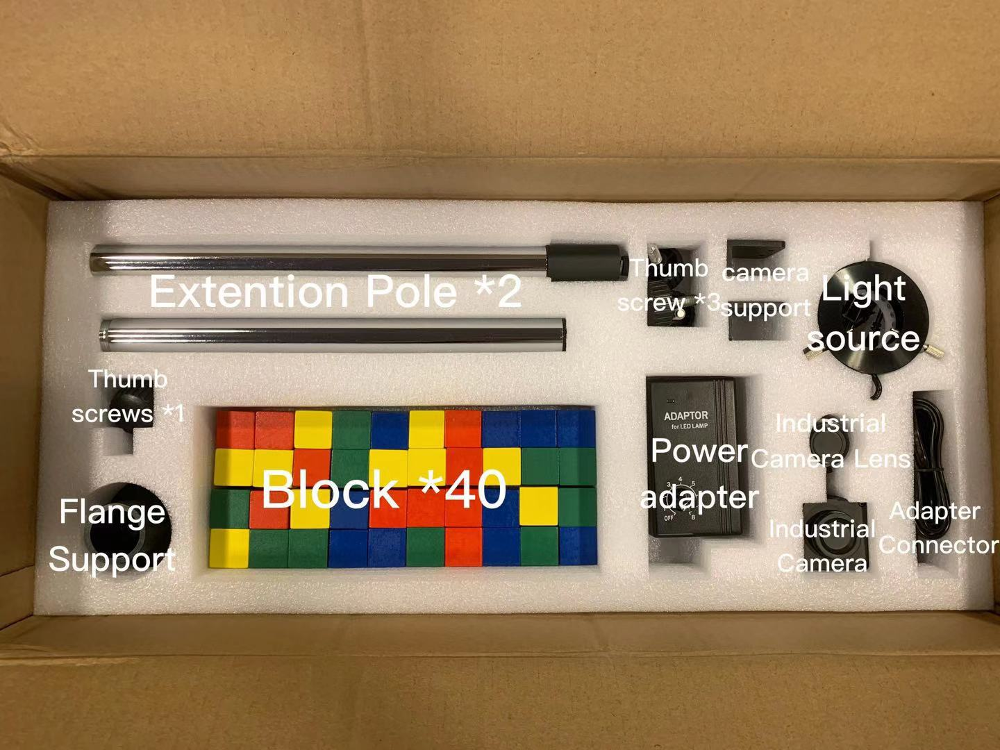
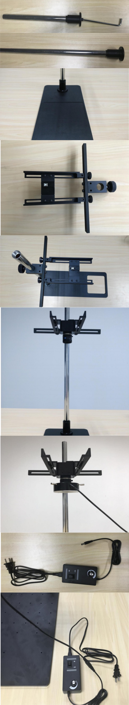
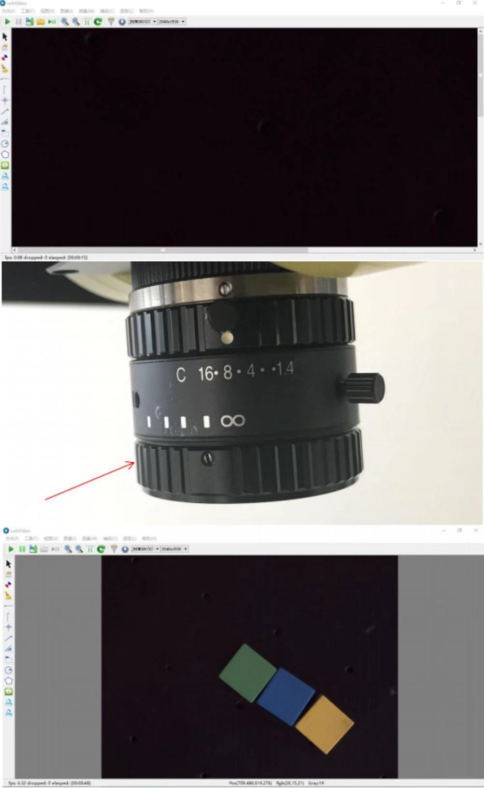
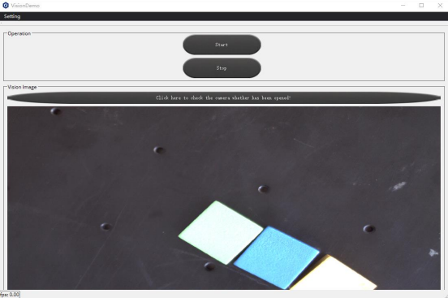
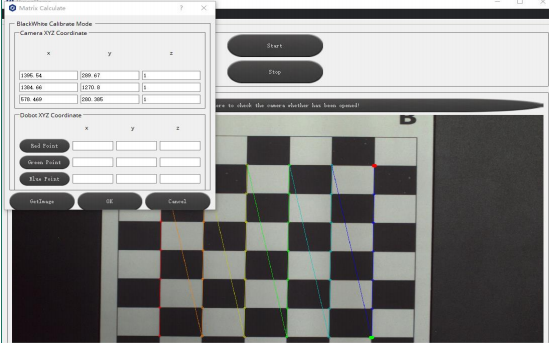
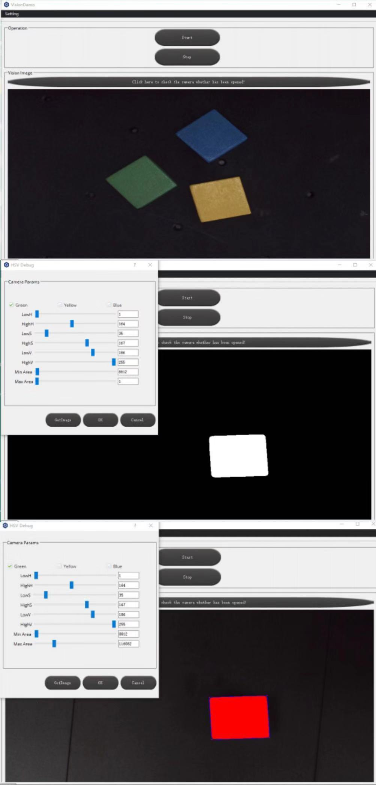
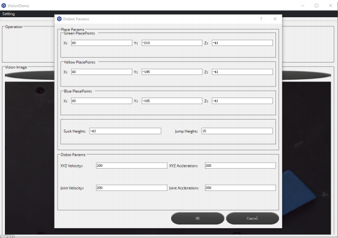
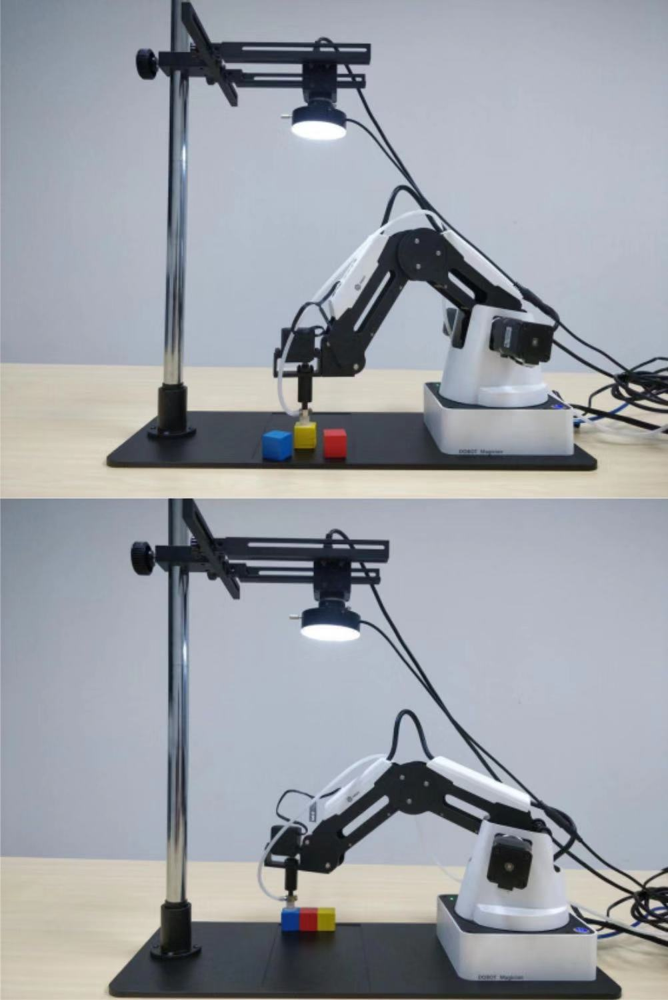

# Dobot Magician - Robot Vision Starter Kit
DOBOT Robot Vision Kit provides a basic software and hardware platform based on visual development. With the advantages of rich functions, stable performance, and convenient operation, it perfectly meets the needs of visual applications including visual positioning, measurement, detection, and recognition. The kit is an extension for the Dobot Magician and can be used together with the robot. 
In this repository you will get information that helps you assemble the device, and set it up to work.

## Content

* [Where To Find](#where-to-find)
* [In The Box](#in-the-box)
* [How To Make It Works](#how-to-make-it-works)
  * [Assemble Camera](#assemble-camera)
  * [Assemble Dobot Magician](#assemble-dobot-magician)
  * [Camera Calibration](#camera-calibration)
  * [Parameters Adjustment](#parameters-adjustment)
* [Functions](#functions)
* [Other Related Software and Third Party SDK](#other-related-software-and-third-party-sdk)
* [Putting The Device Back](#putting-the-device-back)
* [More Documentations](more-documentations)

## Where To Find
Storage Room - C

## In The Box
In the Robot-Vision Starter Kit, we have 3 layers of components. Please follow the pictures when you are packing the vision kit. 

## How To Make It Works
Since the vision kit is from the old version, the document in Dobot magician website doesn't woke. Please check the detailed manauls [here](https://www.generationrobots.com/media/dobot-vision-kit-quickstart-guide.pdf).
### Assemble Camera
   1.  Fix the camera flange bearing at the bottom of the extension rod by screws, and connect the two extension rods.
   2.  Fix the camera flange bearing with at the camera plate by 4 M5*12 hexagonal screws.
   3. Fix the industrial camera in the center of the fixture and adjust the spacing.
   4.  After assembling the camera support, fit it on the connecting rod and adjust the fixture on the camera support so that the camera support is fixed (about 50cm from the base plate).
   5.  Pass the light source through the industrial camera, tighten three fixing knobs on the light source kit to lock it on the camera, connect the power supply.
    
   
    
### Assemble Dobot Magician 
   The Dobot arm place on the floor, adjust the camera bracket, ensure the camera can be observed in the basic mechanical arm motion range. Connect the power and plug in the USB with the computer, the visual package is completed.

### Camera Calibration
   1. Connect camera to computer by USB cable, open the usbVideo.exe software, click "Start" button to regulate focal length of the camera manually (note: Take off the light source before regulating the focal length, and put it back after the regulation process.), regulate the camera view to the best condition, and close the usbVideo.exe software. 
   
   
   2. Power on Dobot Magician, connect the robot arm to the computer by USB cable, open VisionDemo.exe software, and click “Click here to check the camera whether has been opened!” button, open the light source light and regulate it to the suitable luminance until the clear image is shown.
     
     
   3. Put the calibration board under camera in black and white board, open VisionDemo.exe, click "setting", choose "Matrix Calculate" function, click "GetImage", the calibration board will show, red, grean and blue, 3 color point, the softeware will automated record the coordinate parameter of these three points under the camera (note: if the camera cannot detect the calibration point, adjust the light from light source till the camera can read the calibration board).
     
     
   4. Use Penholder kit as the end tool of the robot arm, and according to the sequence of red, green and blue, respectively move the pen tip at the end of robotic arm to the three points (manually drag the robotic arm to the corresponding point, use the software inching Dobot Jog function to operate fine adjustment. At this time, the Matrix Calculate can be closed, and then it can be opened after the fine adjustment). Respectively click three buttons, namely Red Point, Green Point, Blue Point, when the pen tip reaching one point to record the coordinate of the three points respectively, click ok button to finish the calibration, and exit the Matrix Calculate. (Note: the sequence of the three points shall be calibrated in turn, red→green→blue, and the order shall not be incorrect).
     
    
    
### Parameters Adjustment
   1. HSV(Hue Saturation Value) debug adjustment
   Open the HSV Debug, wherein, H, S and V refer to hue, saturation value, and lightness; the value lowH and highH, lowS and highS, and lowV and highV are the hue range, storability range and lightness range between the two values. minArea and maxArea are the pixel area for filtering the influence of small objects. Click GetImage to activate adjustment bar. Firstly, select a color (note: remember the object position on the display window of the target object to be adjusted after acquiring the iamge , such as green shown in Figure 1), then adjust the HSG parameters range of target object, until the target object is completely displayed on the acquired image while objects of other colors completely disappeare. In Figure 2 an example of HSV adjustment for green color is demonstrated. Fellow the same steps to set parameters for other colors. Figure 3 for yellow objects minArea and maxArea regulation, in turn check other colors, adjust and debug.
   
   2. DobotParams adjustment
   After HSV adjustment, open DobotParams, set the coordinate of setting place of the categorized objects, click ok, finish the setting place setttings(Detaild information of setting the operating parameters please refer to the user manual of Dobot Magician).
   
   3. Machine Vison system operation
   The robot vision system is ready to work after setting the parameters. Click Start button, and the robot arm will sort the object according to color.
    

    
## Functions
1. Provide vision for the dobot as a static images or video
2. Provide the workspace for the dobot to integrate with camera

## SDK
The software from dobot website doesn't work since the vision kit we have is an old version. But you can download the correlated demo, vision launch software and program software. In the uploaded files, you will have the following the content and related manuals.

DobotAndCameraDLL
* 1.CameraDLL: The function library of camera opening, closing, setting parameters and so on.
* 2.DobotDLL: The function library of Dobot manipulator operation.
* 3.VisionDLL: The Visual algorithm library of color sorting, shape sorting, normal vector adjustment and so on.

SampleApps
* 1.VisionDemo:
◦It is used for user learning of calibration of robot arm and vision, color and size extraction, sorting operation, etc.
* 2.VisionDemo-S:
◦This document describes the calibrating, color&size extracting, sorting function divide into three sub programs to facilitate users to understand how to achieve all function step by step.

SamplesSourceCode
* 1.Qt-VisionDemo:
◦This source code has completed all the functions: 1, including the parameter setting of the Dobot, the movement of the Dobot, and the alarm cleaning of the Dobot. 2, the connection of the camera, the parameter setting, and so on. 3, the load and call of the algorithm library. Is the collection of calibration, debugging HSV, running sorting as one of the source code.

* 2.Qt-VisionDemo-S:
◦Calibration: The source code for robot arm and vision calibration.
◦HSV_Debug: The source code for color and size feature extraction.
◦SortColor: According to the previous calibration and HSV_Debug, the source code for completing the sorting action.

* 3.PythonDemo:
◦This source provides the Demo that combines OpenCV with robot arm and vision in Python.

* 4.QtDemo-Halcon:
◦This source code is in the Qt development environment, called the Halcon API for feature extraction.

* 5.VisionDll:
◦This source code provides visual algorithm library source, such as calibration, color feature extraction, shape size extraction, object migration direction, etc.

Drive
* 1.DobotDriver: Dobot USB drive.
* 2.CameraDriver: Camera USB drive.
* 3.usbVideo_setup: Camera USB driver and camera parameter settings and other tools.

## Putting The Device Back
After finish using the device, it is important to turn off, disassemble and put it back in the box as it was found, then put the box back in its place.

## More Documentations
* For details how to operate Dobot Magician with DobotStudio APP, please see [here](https://www.youtube.com/watch?v=kyeXwuf17IY)
* For more detailed tutorial videos, you can find it [here](https://www.dobot.cc/videos-center.html?videogallery_id=20#videos).
https://www.dobot.cc/downloadcenter/robot-vision-kit.html

