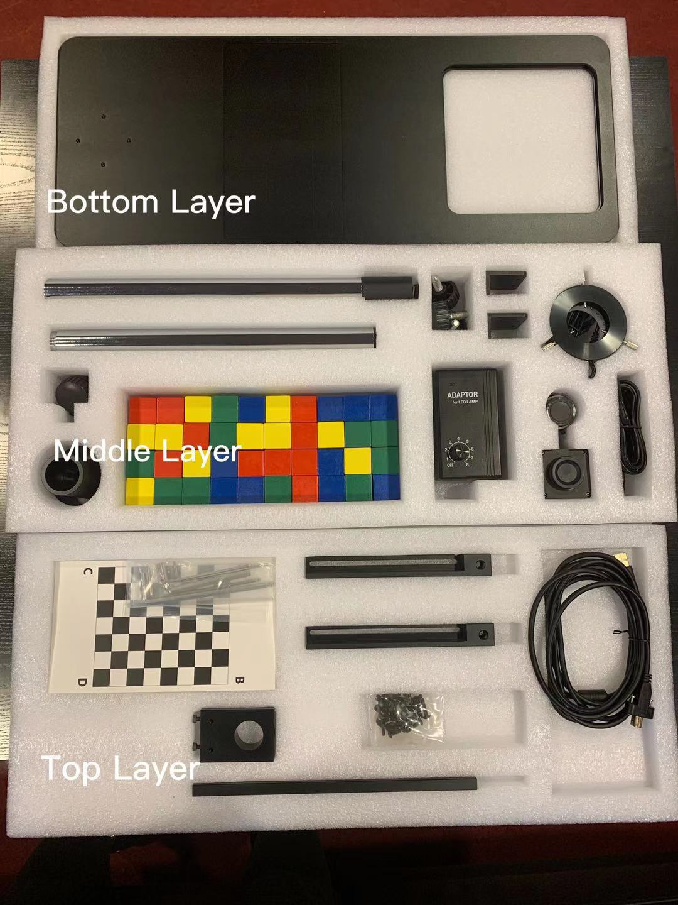
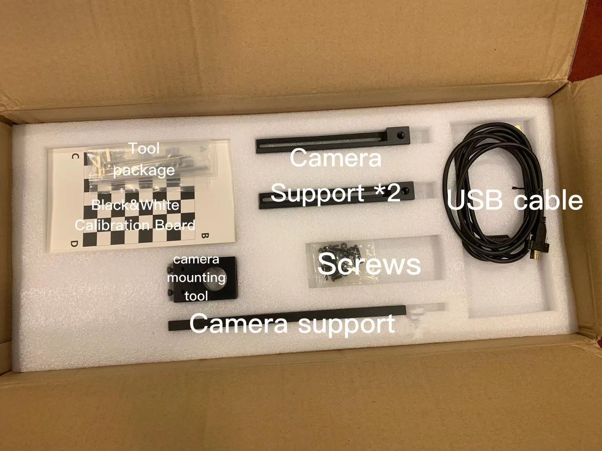
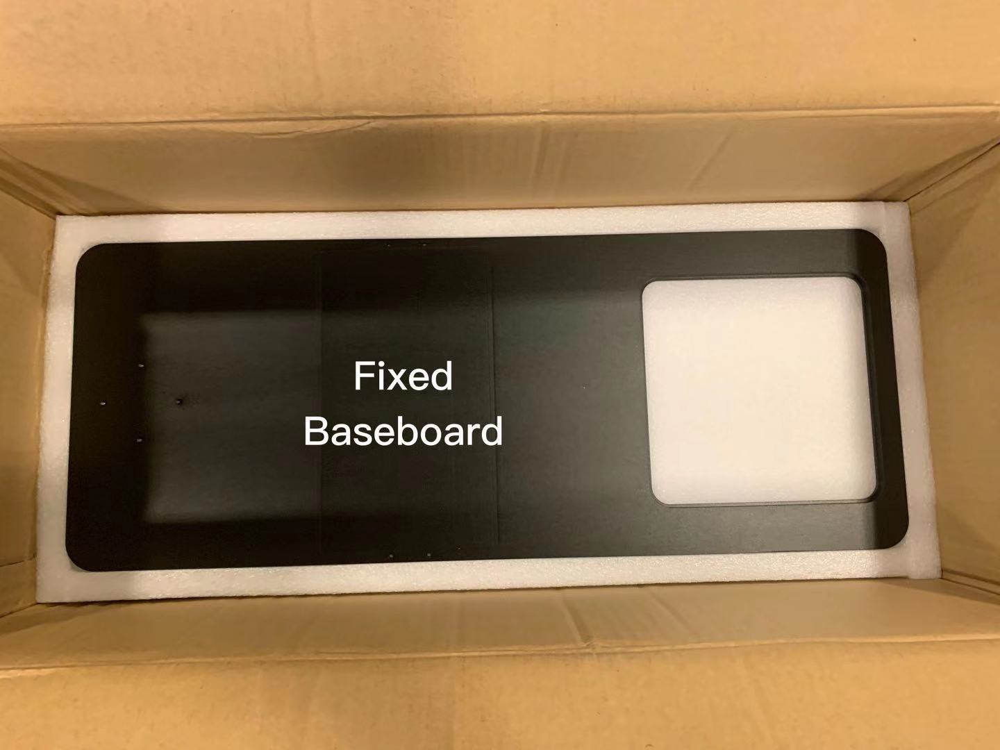

# Dobot Magician - Robot Vision Starter Kit
DOBOT Robot Vision Kit provides a basic software and hardware platform based on visual development. With the advantages of rich functions, stable performance, and convenient operation, it perfectly meets the needs of visual applications including visual positioning, measurement, detection, and recognition. The kit is an extension for the Dobot Magician and can be used together with the robot. 
In this repository you will get information that helps you assemble the device, and set it up to work.

## Content

* [Where To Find](#where-to-find)
* [In The Box](#in-the-box)
* [How To Make It Works](#how-to-make-it-works)
  * [Assembe The Vision Kit](#assembly)
  * [Assembe Dobot Magician](#assembly)
    * [SuctionCup](#suctioncup)
  * [Connecting With PC And Software Setup](#connecting-with-pc-and-software-setup)
* [Operation](#operation)
  * [Quick start 1 - Teaching and Playback](#quick-start-1---teaching-and-playback)
  * [Quick start 2 - Writing and Drawing](#quick-start-2---writing-and-drawing)
  * [Quick start 3 - Blockly](#quick-start-3---blockly)
* [Functions](#functions)
* [SDK](#sdk)
  * [SDK Demos Content](#sdk-demos-content)
  * [Source code](#source-code)
  * [API Interface Description](#api-interface-description)
  * [Examples On Github](#examples-on-github)
* [Putting The Device Back](#putting-the-device-back)
* [More Documentations](more-documentations)

## Where To Find
Storage Room - C

## In The Box
In the Robot-Vision Starter Kit, we have 3 layers of components. Please follow the pictures when you packing them back to the box. 

## How To Make It Works

### Assemble The Vision Kit.
    1. Fix the camera flange support to the bottom of the extension pole with screws.
    2. Connect the two extension poles.
    3. Fix the end of the extension pole with Camera flange support to the camera holder using four M4*10 Hexagon Socket Button Head Screw.
    4. Assemble camera surpport (1) and camera surpport (2) with two M4*10 hexagon socket head cap screws. Figure 2.5 shows the installation style.
    5. Fix the camera support to the extension pole by adjusting the stationary fixture. (Note: Please adjust the height of the camera support based on site requirements. The camera support cannot hinder the movement of robot.)
    6. Fix the camera to the camera mounting plate with three M3*8 hexagon socket countersunk head screws.
    7. Fix the camera mounting plate to the camera support (2) with two M3*6 hexagon socket head cap screws and two washers.
    8. Connect camera to computer with USB cable (plug blue connector into USB3.0 interface of computer).
    9. Adjust the camera parameter.
    
### Adjust The Camera Parameter.
    1. Install MVS software on your computer. You can find the installation package with the installation package of DobotVisionStudio.
    2. Run MVS you should see the Dobot in the left side USB menu.
    3. Click the connect button next to the Dobot in the list.
    4. Click the play button at the top of the middle section (workspace).
    5. You should see the camera feed in the software.
    6. Adjust focal length, apreture, and exposure time according to image.

### Assemble The Light Source.
    1. Attach the light source kit to the camera, and fasten the kit with its three fixing knobs.
    2. Connect light source switch to light source.
    3. Connect light source switch to power interface of Dobot Magician.
    4. Connect light source switch to the power adapter of Dobot Magician.
    
### Assemble Dobot Magician
    1. Make sure you have the Dobot Magician assembled and ready.
    2. Fix Dobot Magician to the platform in the empty area.
    3. Adjust the camera support to ensure that the camera can view the workspace of Dobot Magician.
    
## Functions

## SDK

## Putting The Device Back
After finish using the device, it is important to turn off, disassemble and put it back in the box as it was found, then put the box back in its place.

## More Documentations
* For details how to operate Dobot Magician with DobotStudio APP, please see [here](https://www.youtube.com/watch?v=kyeXwuf17IY)
* For more detailed tutorial videos, you can find it [here](https://www.dobot.cc/videos-center.html?videogallery_id=20#videos).
https://www.dobot.cc/downloadcenter/robot-vision-kit.html

